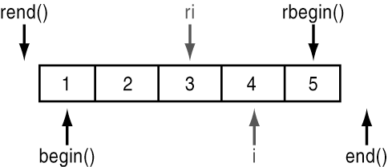

##### 1.mutable

a.用来修饰类成员变量，使用mutable修饰的成员变量，可以在const函数中改变其内容。

假如类的成员函数不会改变对象的状态，那么这个成员函数一般会声明为const。但是，有些时候，我们需要在const的函数里面修改一些跟类状态无关的数据成员，那么这个数据成员就应该被mutalbe来修饰。

```
mutable std::mutex m;
```

b.用来修饰lambda表达，

C++11 引入了 Lambda 表达式，程序员可以凭此创建匿名函数。在 Lambda 表达式的设计中，按值捕获（Caputre by Value）的方式不允许程序员在 Lambda 函数的函数体中修改捕获的变量。而以 mutable 修饰 Lambda 函数，则可以打破这种限制。

```
int a;
auto fm = [=]() mutable { a = 40; }; // 编译正常
auto fm = [=]() { a = 40; };         // 编译错误，不允许修改const值
```


##### 2.volatile

用来修饰变量，使用volatile修饰的变量，编译器对访问该变量的代码就不再进行优化，从而可以提供对特殊地址的稳定访问。


`std::enable_if` 顾名思义，满足条件时类型有效。作为选择类型的小工具，其广泛的应用在 C++ 的模板元编程（meta programming）中。它的定义也异常的简单：

  

```
template <bool, typename T=void>
struct enable_if {
};

template <typename T>
struct enable_if<true, T> {
  using type = T;
};
```

  

##### 3.explicit

声明为explicit的构造函数不能在隐式转换中使用。


##### 4.std::enable_if

```
	// STRUCT TEMPLATE enable_if
template<bool _Test,
	class _Ty = void>
	struct enable_if
	{	// type is undefined for assumed !_Test
	};

template<class _Ty>
	struct enable_if<true, _Ty>
	{	// type is _Ty for _Test
	using type = _Ty;
	};

template<bool _Test,
	class _Ty = void>
	using enable_if_t = typename enable_if<_Test, _Ty>::type;
```

由上可知，只有当第一个模板参数为 `true` 时，`type` 才有定义，否则使用 `type` 会产生编译错误，并且默认模板参数可以让你不必指定类型。下面说说它的几种使用方法：

  

*用法一：类型偏特化*

  

在使用模板编程时，经常会用到根据模板参数的某些特性进行不同类型的选择，或者在编译时校验模板参数的某些特性。例如：

  

```
template <typename T, typename Enable=void>
struct check;

template <typename T>
struct check<T, typename std::enable_if<T::value>::type> {
  static constexpr bool value = T::value;
}; 
```

  

上述的 `check` 只希望选择 `value==true` 的 `T`，否则就报编译时错误。如果想给用户更友好的提示，可以提供结构体的原型定义，并在其中进行 `static_assert` 的静态检查，给出更明确的字符串说明。

  

*用法二：控制函数返回类型*

  

对于模板函数，有时希望根据不同的模板参数返回不同类型的值，进而给函数模板也赋予类型模板特化的性质。典型的例子可以参看 `tuple` 的获取第 k 个元素的 `get` 函数：

  

```
template <std::size_t k, class T, class... Ts>
typename std::enable_if<k==0, typename element_type_holder<0, T, Ts...>::type&>::type
get(tuple<T, Ts...> &t) {
  return t.tail; 
}

template <std::size_t k, class T, class... Ts>
typename std::enable_if<k!=0, typename element_type_holder<k, T, Ts...>::type&>::type
get(tuple<T, Ts...> &t) {
  tuple<Ts...> &base = t;
  return get<k-1>(base); 
}
```

  

由于[函数模板不能偏特化](http://www.gotw.ca/publications/mill17.htm)，通过 `enable_if` 便可以根据 `k` 值的不同情况选择调用哪个 `get`，进而实现函数模板的多态。

  

*用法三：校验函数模板参数类型*

  

有时定义的模板函数，只希望特定的类型可以调用，参考 cppreference 官网示例，很好的说明了如何限制只有整型可以调用的函数定义：

  

```
template <typename T>
typename std::enable_if<std::is_integral<T>::value, bool>::type
is_odd(T t) {
  return bool(t%2);
}

template <typename T, typename = typename std::enable_if<std::is_integral<T>::value>::type>
bool is_even(T t) {
  return !is_odd(t); 
}
```

  

##### 5.# 和 ##

一个通过返回值，一个通过默认模板参数，都可以实现校验模板参数是整型的功能。

\#   -- 转换， 完成代码到字符串的转换 

\## -- 连接， 完成代码的连接


##### 6.delete 弃置函数

 如果取代函数体而使用特殊语法 " = delete ; "，则该函数被定义为*弃置的（deleted）*。任何弃置函数的使用都是非良构的（程序无法编译）


##### 7.lambda的表现

| lambda的表现                                                 |      |      |
| ------------------------------------------------------------ | ---- | ---- |
| [ captures ] <tparams>*(optional)(c++20)* ( params ) specifiers exception attr -> ret requires(optional)(c++20) {body} | (1)  |      |
| [ captures ] ( params ) -> ret { body }                      | (2)  |      |
| [ captures ] ( params ){ body }                              | (3)  |      |
| [ captures ] { body }                                        | (4)  |      |

 

1) Full declaration. 

2) Declaration of a const lambda: the objects captured by copy are const in the lambda body. 

3) Omitted trailing-return-type: the return type of the closure's `operator()` is [deduced](https://en.cppreference.com/w/cpp/language/template_argument_deduction) from [`return`](https://en.cppreference.com/w/cpp/language/return) statements as if for a function whose [return type is declared auto](https://en.cppreference.com/w/cpp/language/function#Return_type_deduction). 

4) Omitted parameter list: function takes no arguments, as if the parameter list was `**()**`. This form can only be used if none of constexpr, mutable, exception specification, attributes, or trailing return type is used. 


**lambda中引用捕捉的重命名：**

&修饰捕捉变量：声明该变量是一个引用，使用=给该引用捕捉赋值。

```c++
#include <iostream>

int main() {
    int a = 10;
    auto func = [&refa = a]() {
        refa++;
    };
    func();
    std::cout << a << std::endl;
    
    return 0;
}
```


##### 8.std::future

类模板 `std::future` 提供访问异步操作结果的机制：

```
#include <iostream>
#include <future>
#include <thread>
 
int main()
{
    // 来自 packaged_task 的 future
    std::packaged_task<int()> task([](){ return 7; }); // 包装函数
    std::future<int> f1 = task.get_future();  // 获取 future
    std::thread(std::move(task)).detach(); // 在线程上运行
 
    // 来自 async() 的 future
    std::future<int> f2 = std::async(std::launch::async, [](){ return 8; });
 
    // 来自 promise 的 future
    std::promise<int> p;
    std::future<int> f3 = p.get_future();
    std::thread( [&p]{ p.set_value_at_thread_exit(9); }).detach();
 
    std::cout << "Waiting..." << std::flush;
    f1.wait();
    f2.wait();
    f3.wait();
    std::cout << "Done!\nResults are: "
              << f1.get() << ' ' << f2.get() << ' ' << f3.get() << '\n';
}
```


##### 9.std::tuple  元组   

类似pair，但不限于2个数据

```
#include <tuple>
#include <iostream>
#include <string>
#include <stdexcept>
 
std::tuple<double, char, std::string> get_student(int id)
{
    if (id == 0) return std::make_tuple(3.8, 'A', "Lisa Simpson");
    if (id == 1) return std::make_tuple(2.9, 'C', "Milhouse Van Houten");
    if (id == 2) return std::make_tuple(1.7, 'D', "Ralph Wiggum");
    throw std::invalid_argument("id");
}
 
int main()
{
    auto student0 = get_student(0);
    std::cout << "ID: 0, "
              << "GPA: " << std::get<0>(student0) << ", "
              << "grade: " << std::get<1>(student0) << ", "
              << "name: " << std::get<2>(student0) << '\n';
 
    double gpa1;
    char grade1;
    std::string name1;
    std::tie(gpa1, grade1, name1) = get_student(1);
    std::cout << "ID: 1, "
              << "GPA: " << gpa1 << ", "
              << "grade: " << grade1 << ", "
              << "name: " << name1 << '\n';
 
    // C++17 结构化绑定：
    auto [ gpa2, grade2, name2 ] = get_student(2);
    std::cout << "ID: 2, "
              << "GPA: " << gpa2 << ", "
              << "grade: " << grade2 << ", "
              << "name: " << name2 << '\n';
}
```


##### 10.boost::optional

 optional库使用"容器"语义，包装了"可能产生无效值"的对象，实现了"未初始化"的概念.

用法：
optional的接口简单明了，把它认为是一个大小为1并且行为类似指针的容器就可以了，或者把它想象成是一个类似scoped_ptr,shared_ptr的智能指针(注意，optional不是智能指针，用法类似但用途不同)。


##### 11.std::multimap::equal_range

返回容器中所有拥有给定关键的元素范围。范围以二个迭代器定义，一个指向首个*不小于* `key` 的元素，另一个指向首个*大于* `key` 的元素。首个迭代器可以换用 [lower_bound()](https://zh.cppreference.com/w/cpp/container/multimap/lower_bound) 获得，而第二迭代器可换用 [upper_bound()](https://zh.cppreference.com/w/cpp/container/multimap/upper_bound) 获得。


##### 12.flat_map / flat_set

Using sorted vectors instead of tree-based associative containers


##### 13.alignas  指定类型或对象的对齐要求。 

alignas的目的是允许你往更大的字节数去对齐，不能指定比本身还小的对齐。比如下面的代码

```c
	struct alignas(1) Point
	{
		int a;
		char b;
	}p;
	
	cout<<alignof(p)<<endl;
	cout<<sizeof(p)<<endl;
	
	#pragma pack(push)
	#pragma pack(1)
	struct Point2
	{
		int a;
		char b;
	}p2;
	#pragma pop(pop)
	
	cout<<alignof(p2)<<endl;
	cout<<sizeof(p2)<<endl;
```

p输出的是4和8，而p2输出的是1和5.


##### 14.decay_t    左值到右值、数组到指针及函数到指针隐式转换

对类型 T 应用左值到右值、数组到指针及函数到指针隐式转换，移除 cv 限定符，并定义结果类型为成员 typedef type 。正式而言： 
若T 指名“ U 的数组”或“到 U 的数组的引用”类型，则成员 typedef type 为 U* 。 
否则，若 T 为函数类型 F 或到它的引用，则成员 typedef type 为std::add_pointer<F>::type 。 
否则，成员 typedef type 为 std::remove_cv<std::remove_reference<T>::type>::type 。 
这些转换模仿在以值传递时，应用到所有函数参数的类型转换。 


##### 15.运算符重载

```
operator string() const;    // 重载(string)a操作符，将a转为string类型

string operator()() const;  // 重载 a()操作符，返回string
```


##### 16.反向迭代器reverse_iterator的删除操作


迭代器erase删除元素时，不能直接使用reverse_iterator。需要用base()转换为普通迭代器使用。



    #include <iostream>
    #include <list>
    
    using namespace std;
    
    void print_list(const list<int>& lst) {
        for (auto val: lst) {
            cout << val << " ";
        }
        cout << endl;
    }
    
    int main() {
        list<int> lst = {1,2,3,4,5,6,7,8,9};
        
        print_list(lst);
        for (auto it = lst.rbegin(); it != lst.rend(); ) {
            if (*it == 7 || *it == 3) {
                it++;
                lst.erase(it.base());
            }
            else {
                it++;
            }
        }
        print_list(lst);
    }


##### 17.多索引容器：有序容器的比较函数对象：operator()(const T&,contT&) const

翻看 composite_key.hpp ，典型的less比较函数对象写法如下：

    struct generic_operator_less
    {
      template<typename T,typename Q>
      bool operator()(const T& x,const Q& y)const{return x<y;}
    };


##### 18.日期和时间：std::chrono 库

定义了三种主要类型：

**时钟：**

*system_clock*：系统时钟时间，能够与C风格时间相互转换。

*steady_clock*：因为物理时间向前移动，此时钟的时间点无法减少。此时钟与系统时钟时间无关，适合用来度量时间间隔。

*high_resolution_clock*：具体由不同编译器实现，表示能提供的计时周期最短的时钟。甚至可能直接是system_clock或者steady_clock的别名。

​	成员有：

​		rep	        	表示时钟时长中计次数的有符号算术类型
​		period		表示时钟计次周期的 std::ratio 类型，单位为秒
​		duration		std::chrono::duration<rep, period> ，足以表示负时长
​		time_point	std::chrono::time_point< std::chrono::system_clock >

**时间点：**

*time_point*：时间点是从特定时钟的纪元开始经过的时间时长。​	

​	duration time_since_epoch() const;

**时长：**duration

***时长的辅助类型***

| 类型                           | 定义                                                         |
| ------------------------------ | :----------------------------------------------------------- |
| std::chrono::nanoseconds       | duration</*至少 64 位的有符号整数类型*/, [std::nano](http://zh.cppreference.com/w/cpp/numeric/ratio/ratio)> |
| std::chrono::microseconds      | duration</*至少 55 位的有符号整数类型*/, [std::micro](http://zh.cppreference.com/w/cpp/numeric/ratio/ratio)> |
| std::chrono::milliseconds      | duration</*至少 45 位的有符号整数类型*/, [std::milli](http://zh.cppreference.com/w/cpp/numeric/ratio/ratio)> |
| std::chrono::seconds           | duration</*至少 35 位的有符号整数类型*/>                     |
| std::chrono::minutes           | duration</*至少 29 位的有符号整数类型*/, [std::ratio](http://zh.cppreference.com/w/cpp/numeric/ratio/ratio)<60>> |
| std::chrono::hours             | duration</*至少 23 位的有符号整数类型*/, [std::ratio](http://zh.cppreference.com/w/cpp/numeric/ratio/ratio)<3600>> |
| std::chrono::days (C++20 起)   | duration</*至少 25 位的有符号整数类型*/, [std::ratio](http://zh.cppreference.com/w/cpp/numeric/ratio/ratio)<86400>> |
| std::chrono::weeks (C++20 起)  | duration</*至少 22 位的有符号整数类型*/, [std::ratio](http://zh.cppreference.com/w/cpp/numeric/ratio/ratio)<604800>> |
| std::chrono::months (C++20 起) | duration</*至少 20 位的有符号整数类型*/, [std::ratio](http://zh.cppreference.com/w/cpp/numeric/ratio/ratio)<2629746>> |
| std::chrono::years (C++20 起)  | duration</*至少 17 位的有符号整数类型*/, [std::ratio](http://zh.cppreference.com/w/cpp/numeric/ratio/ratio)<31556952>> |
|                                |                                                              |

```
#include <chrono>
int main()
{
    std::chrono::hours h(1); // 一小时
    std::chrono::milliseconds ms{3}; // 3 毫秒
    std::chrono::duration<int, std::kilo> ks(3); // 3000 秒
 
    // 错误： treat_as_floating_point<int>::value == false,
    // 此时长只允许整数计次
	//  std::chrono::duration<int, std::kilo> d3(3.5);
 
    // 使用小数计次的 30Hz 钟
    std::chrono::duration<double, std::ratio<1, 30>> hz30(3.5);
 
    // 从 3 毫秒构造 3000 微秒
    std::chrono::microseconds us = ms;
    // error: 1/1000000 is not divisible by 1/1000
	//  std::chrono::milliseconds ms2 = us
    std::chrono::duration<double, std::milli> ms2 = us; // 3.0 微秒
}
```

eg:

    #include <iostream>
    #include <chrono>
    #include <ctime>
    
    using namespace std;
    
    int main() {
        //system_clock
        cout << "system_clock -----------------------------" << endl;
        chrono::time_point<chrono::system_clock, chrono::seconds> tp(chrono::seconds(2)); //距离时间戳2两秒
        chrono::time_point<chrono::system_clock, chrono::milliseconds> aaaa(tp);
    	cout << "to epoch : " <<tp.time_since_epoch().count() << "s" <<endl;
    	time_t tt = chrono::system_clock::to_time_t(tp); //转化为ctime，打印输出时间点
    	cout << ctime(&tt);
    
        chrono::system_clock::time_point tp2 = std::chrono::system_clock::now(); //当前时间，默认精度纳秒
        cout << "to epoch : " << tp2.time_since_epoch().count() << "ns" << endl;
        tt = chrono::system_clock::to_time_t(tp2);
        cout << ctime(&tt);
    
        //当前时间转换为秒级精度
        //chrono::time_point<chrono::system_clock, chrono::seconds> tp3(tp2)    //纳秒到秒的转换会损失精度，禁止隐式转换
        chrono::time_point<chrono::system_clock, chrono::seconds> tp3 = chrono::time_point_cast<chrono::seconds>(tp2);
        cout << "to epoch : " << tp3.time_since_epoch().count() << "s" << endl;
        tt = chrono::system_clock::to_time_t(tp3);
        cout << ctime(&tt);
    
        chrono::time_point<chrono::system_clock, chrono::milliseconds> tp4(tp3); //秒到毫秒的隐式转换
        cout << "to epoch : " << tp4.time_since_epoch().count() << "ms" << endl;
        tt = chrono::system_clock::to_time_t(tp4);
        cout << ctime(&tt);
        cout << endl;
    
    	cout << "steady_clock -----------------------------" << endl;
        chrono::time_point<chrono::steady_clock, chrono::seconds> stc(chrono::seconds(2));
        cout << "to epoch : " << stc.time_since_epoch().count() << "s" << endl;
        //无法将steady_clock转为time_t类型，只有system_clock可以转换系统时间
        //time_t tt_stc = chrono::system_clock::to_time_t(stc);
    
     	chrono::steady_clock::time_point stc2 = std::chrono::steady_clock::now();   //当前时间，默认精度纳秒，一般实现为开机到现在的时间
    	cout << "to epoch : " <<stc2.time_since_epoch().count() << "ns" << endl;
    
        //当前时间转换为秒级精度
        //chrono::time_point<chrono::steady_clock, chrono::seconds> stc3(stc2)    //纳秒到秒的转换会损失精度，禁止隐式转换
        chrono::time_point<chrono::steady_clock, chrono::seconds> stc3 = chrono::time_point_cast<chrono::seconds>(stc2);  //当前时间转换为秒级精度
        cout << "to epoch : " << stc3.time_since_epoch().count() << "s" << endl;
    
        chrono::time_point<chrono::steady_clock, chrono::milliseconds> stc4(stc3);  //秒到毫秒的隐式转换
        cout << "to epoch : " << stc4.time_since_epoch().count() << "ms" << endl;
        cout << endl;
    
        return 0;
    }
**执行结果：**

    root@DESKTOP-HTG58OO:~/test# ./clock
    system_clock -----------------------------
    to epoch : 2s
    Thu Jan  1 08:00:02 1970
    to epoch : 1565590891385530100ns
    Mon Aug 12 14:21:31 2019
    to epoch : 1565590891s
    Mon Aug 12 14:21:31 2019
    to epoch : 1565590891000ms
    Mon Aug 12 14:21:31 2019
    
    steady_clock -----------------------------
    to epoch : 2s
    to epoch : 19212501729000ns
    to epoch : 19212s
    to epoch : 19212000ms


##### 19.内存越界排查

gcc可以直接加链接参数，clang需要设置如下环境变量：

```shell
export  ASAN_OPTIONS="use_sigaltstack=1:verbosity=0:handle_segv=1:allow_user_segv_handler=1:detect_leaks=1"
export ASAN_SYMBOLIZER_PATH="/usr/lib/llvm-4.0/bin/llvm-symbolizer"
```

编译参数：debug无优化模式下，崩溃后栈更清楚

```
-g -O1
```

**链接参数**：增加链接参数，CMake使用时，在target_link_libraries中增加该参数。

```
-fsanitize=address -fno-omit-frame-pointer
```


**20.一次内存越界写错误的排查**

**使用工具**：AddressSanitizer(ASan)

**现象：**
进程执行一两个小时后，会产生随机的堆错误：molloc或者free失败。查看dump文件，可以判断时内存越界写导致堆错误引起的。

**排查方法：**

1.排查所有vector的[]操作，未发现可能下标越界的代码。
2.排查所有裸指针，确定没有越界的代码。
3.使用AddressSanitizer(ASan)排查，增加链接参数：-fsanitize=address -fno-omit-frame-pointer。
4.执行时发现一个vector<shared_ptr>的赋值操作导致段错误。其他同事读代码发现使用的reserve对vector进行的初始化。修改为resize进行初始化后问题不再复现。

**原因：**
reserve操作只分配内存段，并不会分配所有物理内存页。导致后面使用[]操作vector上的对象时如果产生缺页中断，会动态分配内存页到地址空间。如果该内存页被污染，则析构vector上成员时会减少shared_ptr的引用数量（used_count），还可能导致shared_ptr持有的对象被错误的析构。这两种操作都会导致内存越界写错误。